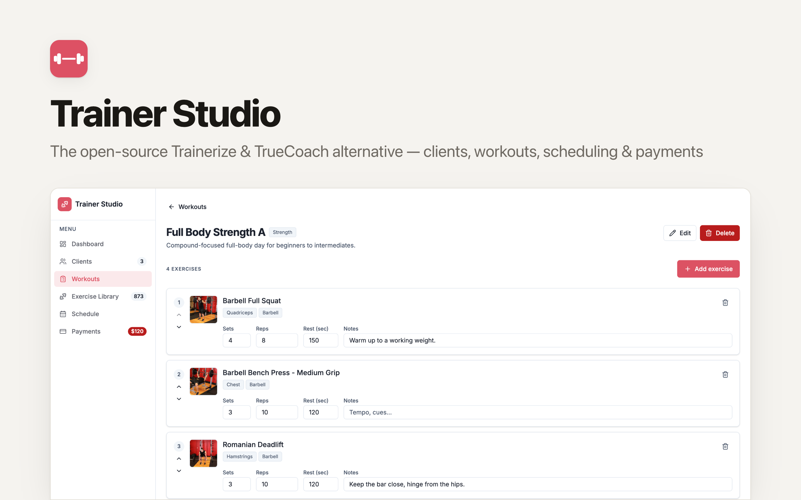

# OpenPersonalTraining: The Open-Source Trainerize & TrueCoach Alternative

[](https://app.clawnify.com/deploy?repo=clawnify/open-personal-training)

An all-in-one platform for personal trainers and online coaches. Manage your clients, build workouts from a library of **800+ illustrated exercises**, assign programs, schedule sessions, and track payments — all in one place. Built with **Preact + Tailwind CSS + Hono + D1**. Deploys to Cloudflare Workers via [Clawnify](https://clawnify.com).

Think of it as an open-source, self-hostable alternative to **Trainerize**, **TrueCoach**, or **My PT Hub** — the coaching admin stack you actually own and can customize.

## Features

- **Clients** — a lightweight CRM for trainees: goal, status, contact, session history, and outstanding balance at a glance.
- **Exercise library** — 800+ exercises seeded in, each with a demonstration image, searchable and filterable by body part, target muscle, and equipment, plus step-by-step instructions.
- **Workout builder** — assemble reusable workouts from the library with per-exercise sets, reps (`8-12`, `AMRAP`, `30s`…), rest, and notes. Reorder freely.
- **Share with clients** — generate a public, mobile-friendly link for any workout (no login) that your client opens on their phone with images and instructions, or saves as a PDF. Revoke it any time.
- **Schedule** — one calendar for in-person 1-on-1s, remotely-assigned programs, consultations, and assessments. Mark completed / no-show / cancelled.
- **Payments** — a simple ledger for session packs and monthly coaching, with collected vs. outstanding totals.
- **Dashboard** — today's schedule plus at-a-glance client, workout, revenue, and outstanding stats.

Every screen is also a clean JSON API, so the Clawnify agent can run the admin for you — "build a push day and assign it to Casey for Monday", "who owes me money?" See [`agent.md`](agent.md).

## The exercise dataset

The library is seeded at build time from the [free-exercise-db](https://github.com/yuhonas/free-exercise-db) dataset — **public domain (Unlicense)**, 873 exercises, each with a demonstration image and step-by-step instructions. Data ships in the D1 seed (`src/server/schema.sql`); images are served from jsDelivr, pinned to an immutable commit SHA (`src/client/lib/exercise-image.ts`), so nothing to host and no third-party API to depend on.

## Quickstart

```bash
git clone https://github.com/clawnify/open-personal-training.git
cd open-personal-training
pnpm install
pnpm dev
```

Open `http://localhost:5173`. The D1 schema — tables plus the full exercise library and example clients/workouts — is applied automatically on startup.

## Tech Stack

| Layer | Technology |
|-------|-----------|
| **Frontend** | Preact, TypeScript, Tailwind CSS v4, Vite |
| **Backend** | Hono (Cloudflare Worker), `@hono/zod-openapi` |
| **Database** | D1 (SQLite at the edge) via `@clawnify/db` |
| **Hosting** | Cloudflare Workers (Workers for Platforms via Clawnify) |

## Data model

`clients` · `exercises` (seeded) · `workouts` → `workout_exercises` (ordered prescriptions) · `sessions` (schedule + assigned programs) · `payments`. See [`src/server/schema.sql`](src/server/schema.sql). The REST contract is generated at `/api/openapi.json`.

## License

MIT — see [LICENSE](LICENSE).
